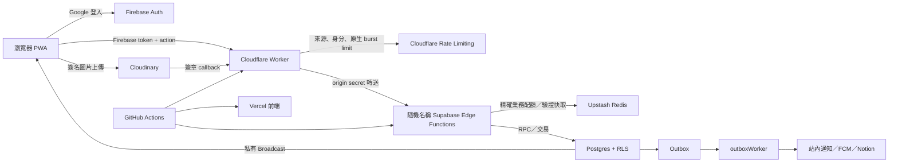
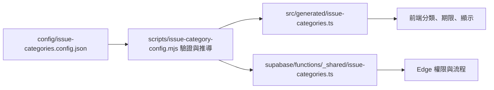

# 系統架構

本頁先用一條請求解釋系統，再列模組邊界。部署者不需要理解每個檔案；只有開發、資安審查或事故定位時才需要深入。

## 一次操作經過哪裡

重要原則：瀏覽器不被信任；Cloudflare 先擋下 CORS、未登入、webhook 簽章與短時間刷取，Supabase Edge 再檢查精確業務配額，Postgres 仍重新授權並保存正式關係與計數。Cloudflare 不是唯一權限層。

## 前端層級

| 目錄 | 責任 |
| --- | --- |
| `views/` | 路由頁組裝與頁面級狀態，不直接存取資料 |
| `components/` | 應用 UI 與事件轉發 |
| `components/ui/` | 無業務資料、service、session 相依的共用 UI |
| `composables/` | Vue 狀態、生命週期與跨元件流程 |
| `services/` | `backendAction` 與 Supabase client 邊界 |
| `lib/` | 無 Vue 相依的純工具 |
| `types/` | 跨模組型別 |
| `generated/` | 由 JSON config 產生、前端使用的型別化規則 |

主要路由是提案列表／詳情、公告列表／詳情、通知、設定與管理 Dashboard。桌面與手機共用資料流，只切換 layout。

共用視覺契約位於 `src/styles/primitives.css` 與 `components/ui/`，並依 `atoms → molecules → organisms` 單向組合。`AppShell`／`ViewportFrame`／`RoutePageFrame` 統一管理 viewport gutter、safe area、內容寬度與 route page 骨架；button、card、list、dropdown、Dialog、control 由共用元件組合，陰影只分 control、card、floating 三階。完整規範與新頁面清單見 [UI 設計系統](ui-design-system.md)。

路由切換由路由深度與來源決定方向：手機版子頁與巢狀詳情使用 push／pop，同層使用輕量 fade，從通知開啟詳情時會保留返回通知的來源。桌面版維持輕量網頁轉場；導覽 shell 與內容狀態仍保持分離。

## 本地化與錯誤契約

前端語系目錄使用 `src/i18n/messages/<locale>/<domain>.ts`，每個檔案只維護自己的功能領域，key 採短而穩定的語意名稱。繁中與英文必須擁有相同 key；前端只能用 key 查詢字串，不以中文原文反查翻譯。

`config/api-errors.config.json` 是公開 API 錯誤的單一來源，產生前端、Cloudflare Worker 與 Supabase Edge 使用的型別化契約。失敗回應只包含穩定 `code`、`requestId`，限流時另帶 `retryAfterSeconds`；後端不回傳中文、英文句子或供應商原始錯誤。前端依 `code` 對應目前語系，完整技術細節留在以 request ID／trace ID 索引的 log。

背景工作、刪除工作、Push delivery 與 maintenance 資料表只保存 `error_trace_id uuid`，不保存重複的錯誤句子。Dashboard 同樣傳回 `failed_task_codes` 與 `error_trace_id`，由前端負責顯示文字。

## 後端入口

| Function | 真實責任 |
| --- | --- |
| `n<namespace>-api` | 原始碼為 `backendAction`；角色、冪等、驗證與領域分派 |
| `n<namespace>-sync` | 原始碼為 `syncUser`；登入後同步允許網域使用者與角色 claim |
| `n<namespace>-media` | 原始碼為 `cloudinaryWebhook`；再次驗證 callback 並更新上傳狀態 |
| `n<namespace>-outbox` | 處理通知、FCM、選用的 Notion 同步與外部副作用 |
| `n<namespace>-delete` | 清除 Cloudinary 資源並同步刪除狀態 |
| `n<namespace>-maintenance` | 執行保留期、維護 RPC，並觸發 deletion/outbox workers |

## 分類設定如何生效

原始 JSON 只要求人能理解的欄位。產生器會推導作者儲存、附件／留言可見性、留言開放時機、附議未達標自動結束，以及回應期限從建立或附議達標開始。前端與 Edge 共享同一來源，避免各自寫一套規則。

## 資料與副作用

Postgres 是 source of truth。需要通知、Push、Notion 或其他外部服務的交易，先在同一資料庫交易寫入 outbox，再由 worker 執行。這讓主要資料成功不依賴第三方當下是否在線，也讓失敗可以重試與追蹤。

保留期清理提案或設備時，若存在 Notion 對應頁面，會在刪除主資料的同一交易排入刪除同步事件；這類排程清理不會另發使用者通知，但仍會由正常 outbox 重試與追蹤。

圖片採兩段式流程：取得受權限控制的上傳簽名、上傳至 Cloudinary、驗證 callback、保存狀態；讀取時再依內容權限取得短效簽名 URL。

## 即時更新與驗證快取

內容、通知與通知已讀狀態透過 Supabase Realtime 的私有 Broadcast topics 傳送。topic 依校內、管理員或個別使用者分流，連線時由 `realtime.messages` RLS 驗證 Firebase 身分與角色；登入者不需要、也沒有權限直接查詢通知、通知狀態或即時事件私有資料表。Broadcast 只用來提示前端更新，Postgres 仍是 source of truth。

Edge 驗證 Firebase token 後，會將必要的使用者資料短暫保存在 Function instance 記憶體與 Upstash Redis。快取失效時才重新呼叫 Firebase，並保留過期與數量上限，減少重複外部請求而不改變每個 action 的授權檢查。

前端內容讀取會依帳號保存在記憶體與 IndexedDB，維持積極的長效快取以減少伺服器與外部服務用量。記憶體層使用有數量上限的 LRU，讀取命中會更新最近使用順序；持久層仍保留較長存活時間。每次請求攜帶 scope 與失效版本；若寫入、Realtime 或切換帳號已讓資料過期，較早完成的請求不能把舊內容重新寫回，持久層也只刪除同一寫入版本，避免誤刪後續新資料。

PWA 發現新版本後會要求 waiting Service Worker 立即接管，等待 `controllerchange` 後以版本化 URL 重新載入；watchdog 與每版本重載次數上限會終止失敗循環。更新流程不保留舊版相容分支，也不需要清除資料庫或關閉積極內容快取。

## 部署拓樸

- `main` → GitHub `production` Environment → Cloudflare Worker + Supabase production + Vercel production。
- `dev` → `development` Environment → 只有維護測試站時才建立的另一套資源。
- config 或 Supabase 變更會觸發後端；前端若同時變更會等待同 commit 後端成功。
- backend workflow 套 migration、由 GitHub secrets 自動設定 Cloudflare／Edge、部署隨機 Functions 與固定 Worker、健康檢查。
- frontend workflow 由 Vercel CLI build 並 deploy prebuilt artifacts。

完整檔案位置以主程式 repository 的 `structure.md` 為準。
