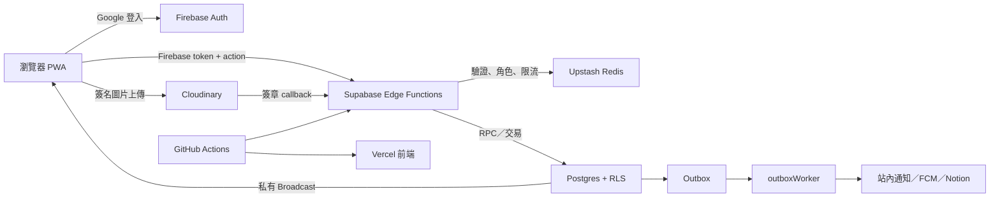
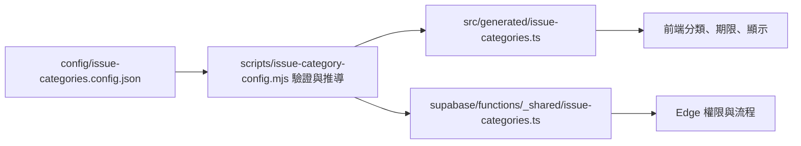

# 系統架構

本頁先用一條請求解釋系統，再列模組邊界。部署者不需要理解每個檔案；只有開發、資安審查或事故定位時才需要深入。

## 一次操作經過哪裡

重要原則：瀏覽器不被信任；UI 顯示條件只改善體驗，真正權限由 Edge 驗證、Postgres RLS、RPC 與資料約束執行。

## 前端層級

| 目錄 | 責任 |
| --- | --- |
| `views/` | 路由頁組裝與頁面級狀態，不直接存取資料 |
| `components/` | 應用 UI 與事件轉發 |
| `components/ui/` | 無業務資料、service、session 相依的共用 UI |
| `composables/` | Vue 狀態、生命週期與跨元件流程 |
| `services/` | `backendAction` 與 Supabase client 邊界 |
| `lib/` | 無 Vue 相依的純工具 |
| `types/` | 跨模組型別 |
| `generated/` | 由 JSON config 產生、前端使用的型別化規則 |

主要路由是提案列表／詳情、公告列表／詳情、通知、設定與管理 Dashboard。桌面與手機共用資料流，只切換 layout。

## 後端入口

| Function | 真實責任 |
| --- | --- |
| `backendAction` | 統一 action 閘道：CORS、Firebase token、角色、限流、冪等、驗證與領域分派 |
| `syncUser` | 登入後同步允許網域使用者與角色 claim |
| `cloudinaryWebhook` | 驗證 Cloudinary callback 並更新上傳狀態 |
| `outboxWorker` | 處理通知、FCM、選用的 Notion 同步與外部副作用 |
| `processDeletionJobs` | 清除 Cloudinary 資源並同步刪除狀態 |
| `maintenanceCleanup` | 執行保留期、維護 RPC，並觸發 deletion/outbox workers |

## 分類設定如何生效

原始 JSON 只要求人能理解的欄位。產生器會推導作者儲存、附件／留言可見性、留言開放時機、附議未達標自動結束，以及回應期限從建立或附議達標開始。前端與 Edge 共享同一來源，避免各自寫一套規則。

## 資料與副作用

Postgres 是 source of truth。需要通知、Push、Notion 或其他外部服務的交易，先在同一資料庫交易寫入 outbox，再由 worker 執行。這讓主要資料成功不依賴第三方當下是否在線，也讓失敗可以重試與追蹤。

圖片採兩段式流程：取得受權限控制的上傳簽名、上傳至 Cloudinary、驗證 callback、保存狀態；讀取時再依內容權限取得短效簽名 URL。

## 即時更新與驗證快取

內容、通知與通知已讀狀態透過 Supabase Realtime 的私有 Broadcast topics 傳送。topic 依校內、管理員或個別使用者分流，連線時由 `realtime.messages` RLS 驗證 Firebase 身分與角色；登入者不需要、也沒有權限直接查詢通知、通知狀態或即時事件私有資料表。Broadcast 只用來提示前端更新，Postgres 仍是 source of truth。

Edge 驗證 Firebase token 後，會將必要的使用者資料短暫保存在 Function instance 記憶體與 Upstash Redis。快取失效時才重新呼叫 Firebase，並保留過期與數量上限，減少重複外部請求而不改變每個 action 的授權檢查。

## 部署拓樸

- `main` → GitHub `production` Environment → Supabase production + Vercel production。
- `dev` → `development` Environment → 只有維護測試站時才建立的另一套資源。
- config 或 Supabase 變更會觸發後端；前端若同時變更會等待同 commit 後端成功。
- backend workflow 套 migration、設定 Edge secrets、部署 Functions、健康檢查。
- frontend workflow 由 Vercel CLI build 並 deploy prebuilt artifacts。

完整檔案位置以主程式 repository 的 `structure.md` 為準。
