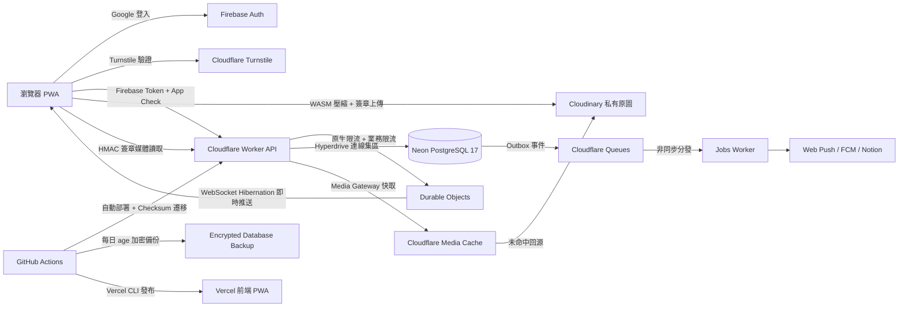

# 系統架構

本頁說明 Novae 的整體系統架構、元件邊界、資料流與安全防線。

## 系統資料與請求流

```mermaid
flowchart LR
  U[瀏覽器 PWA] -->|Google 登入| F[Firebase Auth]
  U -->|Turnstile 驗證| T[Cloudflare Turnstile]
  U -->|Firebase Token + App Check| CFW[Cloudflare Worker API]
  CFW -->|原生限流 + 業務限流| DO[Durable Objects]
  CFW -->|Hyperdrive 連線集區| P[(Neon PostgreSQL 17)]
  DO -->|WebSocket Hibernation 即時推送| U
  U -->|WASM 壓縮 + 簽章上傳| CLD[Cloudinary 私有原圖]
  U -->|HMAC 簽章媒體讀取| CFW
  CFW -->|Media Gateway 快取| MC[Cloudflare Media Cache]
  MC -->|未命中回源| CLD
  P -->|Outbox 事件| Q[Cloudflare Queues]
  Q -->|非同步分發| W[Jobs Worker]
  W --> N[Web Push / FCM / Notion]
  G[GitHub Actions] -->|自動部署 + Checksum 遷移| CFW
  G -->|每日 age 加密備份| BK[Encrypted Database Backup]
  G -->|Vercel CLI 發布| V[Vercel 前端 PWA]
```

核心設計原則：**瀏覽器環境不可信任**。Cloudflare Worker 作為唯一的公開 API 閘道，在邊緣先驗證 CORS、Firebase Auth JWT、App Check 與 Turnstile，再透過 Cloudflare Hyperdrive 連線集區存取 Neon PostgreSQL。資料庫操作強制使用最低權限 `novae_runtime` 角色，瀏覽器絕不直接連線資料庫。

## 前端架構層次 (Next.js 16 App Router)

| 目錄 | 職責與邊界 |
| --- | --- |
| `src/app/` | Next.js App Router 路由與 Layout 組裝，負責視窗尺寸與 Providers 邊界，不直接引用後端 service |
| `src/components/ui/` | 無業務邏輯的基礎 UI Primitives（基於 Radix UI 與 Tailwind CSS 4），共用全域語意 Tokens |
| `src/components/motion/` | transitions.dev 動態配方（`LiquidTabs`、`ResizableCard`、微光骨架屏、數字跳動與手勢反饋） |
| `src/components/admin/` | 管理主控台（活動指標概覽、使用者搜尋與互動限制、審計日誌、分類負責人與平台設定） |
| `src/hooks/` | React 狀態、生命週期、快取管理與領域業務邏輯 |
| `src/services/` | Cloudflare Worker API、WebSocket 傳輸、Cloudinary 上傳與 Firebase 認證邊界 |
| `src/lib/` | 無 React 相依的純工具（`navigation-memory`、`request` 超時中斷、WASM 圖片壓縮、Markdown 解析） |
| `src/i18n/` | 繁體中文 (`zh-TW`) 與英文 (`en`) 領域字典目錄與反應式語言切換 |

### 介面與動效系統
- **視覺規範**：`src/app/globals.css` 與 `src/styles/motion.css` 定義統一的色彩、圓角、三階陰影與動效曲線。
- **強調色系統 (Accent Themes)**：支援 Slate、Indigo、Emerald、Rose 等多種品牌強調色，與淺色／深色模式即時切換。
- **導覽記憶 (`navigation-memory`)**：為應用內頁面躍遷標記單調遞增索引，確保上一頁／下一頁能呈現精確的深度方向轉場。
- **討論區安全底欄**：CommentComposer 組件精確對齊 Safe Area，在手機鍵盤開啟時自適應調整高度。

## 後端與資料庫架構

| 組件 | 職責與安全邊界 |
| --- | --- |
| **Cloudflare Worker API** | 唯一的公開入口，處理 Action 分派、JWT 身分驗證、App Check 驗證、Turnstile Siteverify 與 Media Gateway 代理 |
| **Cloudflare Hyperdrive** | 池化 Worker 與 Neon PostgreSQL 之間的連線，實現零冷啟動延遲與查詢加速 |
| **Cloudflare Durable Objects** | 基於 SQLite 的 per-UID 業務限流，以及 WebSocket Hibernation 即時中繼樞紐 |
| **Cloudflare Queues (`novae-jobs`)** | 非同步 Outbox 佇列，處理推播通知 (FCM)、Notion 營運副本同步、Cloudinary 資源刪除與過期案件自動清理 |
| **Neon PostgreSQL 17** | 系統單一真實來源。採用最低權限 `novae_runtime` 資料庫角色（僅限 DML、Sequence 與 Function 執行，無 DDL 權限） |

## 資料版本與即時同步

- 提案、設備與公告各自維護單調遞增的 PostgreSQL 內容版本戳記（Content Version）。
- 任何內容變更在同一交易中觸發版本遞增，並透過 Durable Objects WebSocket Hibernation 即時廣播給在線客戶端。
- 前端收到版本事件後優先進行原地 Local Patch；若發生版本跳號或重連，則透過單次 `getContentVersions` 進行靜默刷新，兼顧極致流暢與資料一致性。

## 資料保留與生命週期排程

- **已結案案件清理**：結案超過平台設定保留期限（預設 180 天）之案件，由背景排程自動永久刪除其資料庫紀錄、留言、附議關聯及 Cloudinary 圖片。
- **審計日誌輪替**：超過 365 天之管理操作紀錄自動清除。
- **未活躍帳號與無效推播裝置**：定期清理長期未活動之個資快照與失效之 FCM Device Tokens。
- **自動化每日備份**：由 GitHub Actions 每日定時執行 `pg_dump`，透過 `age` 非對稱加密後存為 GitHub 加密 Artifacts。
