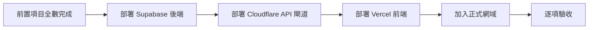

# 最後發布與驗收

只有在八項服務與 production secrets 都完成後，才使用本頁。分類會在部署完成後由首位管理員於程式內設定。

## 發布前確認

開始前，以下項目必須全部完成：

- [ ] 已按[部署準備與服務設定](quick-start.md)完成 GitHub、Firebase、Supabase、Cloudinary、Upstash、Cloudflare 與 Vercel；需要時也完成 Notion。
- [ ] 已按[憑證填寫表](environment-configuration.md)把必要值加入 GitHub `production` Environment secrets。
- [ ] 已確認學校網域與 `ADMIN_EMAILS` 中的首位管理員 Email。
- [ ] 已先決定提案與設備報修分類規則，準備在首次登入引導中填寫。

若有任一項未完成，先回到對應頁面，不要先執行 deployment workflow。

## 發布順序

## 1. 最後核對 production secrets

在 GitHub fork 開啟 `Settings → Environments → production`，依[憑證填寫表](environment-configuration.md)逐項核對名稱與值。值前後不要有多餘空白，也不要把它們放在 repository Variables。

幾組必須一致的值：

- `VITE_ALLOWED_DOMAIN` = `ALLOWED_DOMAIN`
- `VITE_FIREBASE_PROJECT_ID` = `FIREBASE_PROJECT_ID`
- `VITE_FIREBASE_API_KEY` = `FIREBASE_WEB_API_KEY`
- `VITE_GOOGLE_CLIENT_ID` 為同一 Firebase／GCP 專案的 Web OAuth Client ID，且 OAuth client 的 Authorized JavaScript origins 已含正式站（與本機）
- 標準 Cloudinary HMAC 流程：`CLOUDINARY_WEBHOOK_SECRET` = `CLOUDINARY_API_SECRET`
- `CLOUDFLARE_WORKER_URL` 與 `ALLOWED_ORIGINS` 都包含 `https://`，結尾都沒有 `/`
- `ALLOWED_ORIGINS` 是 Vercel 前端網域，不是 Worker 網址

Notion 未啟用時不需建立 Notion secrets；workflow 會以停用模式發布。

## 2. 發布 Supabase 後端

在 GitHub `Actions` 選擇 `Deploy Supabase Backend`，使用 `Run workflow` 對 `main` 執行。等待所有階段成功：

1. 驗證產生設定、Edge 型別與架構。
2. link Supabase project。
3. push migrations。
4. 設定 Edge secrets。
5. 以私密 namespace 部署六個 Supabase Functions。
6. 部署固定名稱的 Cloudflare Worker，Action 自動同步 Worker secrets。
7. smoke test Worker；未帶登入 token 時應回 `401`。
8. 執行 API origin healthcheck 與 maintenance cleanup。

遇到紅色步驟就停止，不要先跑前端。打開第一個失敗步驟，依[一步一步排錯](troubleshooting.md)處理後重新執行。

## 3. 發布 Vercel 前端

後端成功後，再執行 `Deploy Frontend to Vercel`。workflow 會把 `CLOUDFLARE_WORKER_URL` 作為前端 API 根網址，驗證 secrets、讀取 Vercel project 設定、建置 `.vercel/output`，再以 prebuilt deployment 發布。前端成功切換後，workflow 會清除舊的固定 Supabase Function 入口。

之後推送到 `main` 時，相關檔案會自動觸發對應 workflow；若同一個 commit 同時改到後端或 config，前端會等待後端成功。

## 4. 設定正式網域

取得成功的 deployment URL 並確認能開啟後，在 Vercel 將正式網域連到 project，再把該網域加入 Firebase Authentication authorized domains，並把同一 origin 加入 GCP OAuth Web client 的 Authorized JavaScript origins（`VITE_GOOGLE_CLIENT_ID` 所屬 client）。若啟用 App Check，也要確認 reCAPTCHA Enterprise site key 允許正式網域。

## 5. 上線驗收

不要只確認首頁能開，請依序實測：

- [ ] 使用允許網域的 Google 帳號能登入；其他網域被拒絕。
- [ ] 瀏覽器 Network 中 API 呼叫送往 `CLOUDFLARE_WORKER_URL`，不是直接送往 Supabase Function。
- [ ] API 的 `OPTIONS` 預檢回 `204`，且 `Access-Control-Allow-Origin` 等於正式 Vercel Origin。
- [ ] 平台總管理員帳號重新登入後能看到 Dashboard 與管理操作，且程式內沒有授予或撤銷平台總管理員的入口。
- [ ] `ADMIN_EMAILS` 中的首位管理員先確認語言，再完成提案與設備報修分類初始設定；完成動作重試不會建立重複設定。
- [ ] 建立公開、審核型與私密分類的提案，各自可見範圍正確。
- [ ] 附議門檻與天數符合程式內分類設定，舊提案仍沿用建立時快照。
- [ ] 提案與設備看板都能按動態分類瀏覽與建立；分類負責人能依 scope 留言、更新狀態與刪除。
- [ ] 新提案只通知提案分類負責人，新報修只通知已開啟通知的設備分類負責人；未指派的平台總管理員不收件。
- [ ] 圖片可上傳，重新載入後仍可顯示。
- [ ] 管理員能審核、更新狀態並發布公告。
- [ ] 站內通知正常；允許通知後 Web Push 可到達。
- [ ] 若啟用 Notion，已產生營運副本；未啟用時系統正常運作且不把它視為失敗。

驗收成功後才對外公告。接著依[上線後維運](operations.md)定期檢查；若發生問題，從[一步一步排錯](troubleshooting.md)開始。
