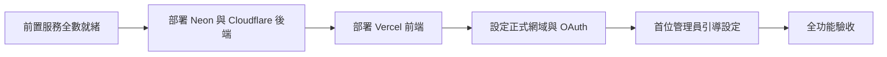

# 最後發布與驗收

只有在所有服務與 production secrets 都填寫完成後，才使用本頁執行最後發布。

## 發布前確認

開始前，以下項目必須全部完成：

- [ ] 已按[部署準備與服務設定](quick-start.md)完成 GitHub、Firebase、Neon、Cloudinary、Cloudflare 與 Vercel；需要時也完成 Notion。
- [ ] 已按[憑證填寫表](environment-configuration.md)把必要值加入 GitHub `production` Environment secrets。
- [ ] 已確認學校網域與 `ADMIN_EMAILS` 中的首位管理員 Email。
- [ ] 已決定提案與設備報修分類規則，準備在首次登入引導中填寫。

## 發布流程

```mermaid
flowchart LR
  A[前置服務全數就緒] --> B[部署 Neon 與 Cloudflare 後端]
  B --> C[部署 Vercel 前端]
  C --> D[設定正式網域與 OAuth]
  D --> E[首位管理員引導設定]
  E --> F[全功能驗收]
```

## 1. 最後核對 production secrets

在 GitHub fork 開啟 `Settings → Environments → production`，依[憑證填寫表](environment-configuration.md)逐項核對名稱與值：

- `NEXT_PUBLIC_ALLOWED_DOMAIN` = `ALLOWED_DOMAIN`
- `NEXT_PUBLIC_FIREBASE_PROJECT_ID` = `FIREBASE_PROJECT_ID`
- `NEXT_PUBLIC_FIREBASE_API_KEY` = `FIREBASE_WEB_API_KEY`
- `NEXT_PUBLIC_GOOGLE_CLIENT_ID` 來自同一 GCP 專案的 Web OAuth Client ID，Authorized JavaScript origins 已含正式站與本機
- `CLOUDFLARE_WORKER_URL` 與 `ALLOWED_ORIGINS` 包含 `https://` 且**結尾絕對沒有 `/`**
- `ALLOWED_ORIGINS` 為 Vercel 前端網域，不是 Worker 網址
- `NEON_DATABASE_URL` 與 `NEON_RUNTIME_PASSWORD` 已正確填入

## 2. 發布後端（Deploy Neon and Cloudflare Backend）

在 GitHub `Actions` 選擇 `Deploy Neon and Cloudflare Backend`，點擊 `Run workflow` 對 `main` 分支執行。

工作流程會自動依序執行：
1. **驗證合約與後端型別**：執行 `npm run generate:all`、檢查 Worker 型別與架構邊界。
2. **套用 Neon 資料庫遷移**：透過 `npm run db:migrate` 執行 Checksum 校驗並套用 `database/migrations/`。
3. **配置最低權限資料庫角色**：執行 `configure-database-runtime.mjs` 建立 `novae_runtime` 角色並驗證存取。
4. **配置 Cloudinary Upload Preset**：自動建立或更新 `srp-secure-images` preset。
5. **同步 Hyperdrive 憑證**：將驗證後的連線字串注入 Cloudflare Hyperdrive。
6. **建立 Cloudflare Queue**：確保 `novae-jobs` 佇列存在。
7. **部署 Cloudflare Worker**：編譯並部署 Worker API 及 Durable Objects。
8. **執行健康檢查 Smoke Test**：驗證未授權時回傳 `401`，帶有 `HEALTHCHECK_SECRET` 時回傳 `200` 且資料庫連線正常。

若有步驟失敗，請打開日誌依[一步一步排錯](troubleshooting.md)處理，不要先跑前端。

## 3. 發布前端（Deploy Frontend to Vercel）

後端成功後，執行 `Deploy Frontend to Vercel` 工作流程。

該流程會等待對應後端部署成功，使用 `CLOUDFLARE_WORKER_URL` 作為 API 端點，建置 Next.js 16 PWA 並發布至 Vercel 正式環境。

## 4. 設定正式網域與 OAuth

在 Vercel 綁定自訂網域後：
1. 將該網域加入 Firebase Authentication 的 **Authorized domains**。
2. 將該 Origin 加入 Google Cloud Console 的 **Authorized JavaScript origins**（`NEXT_PUBLIC_GOOGLE_CLIENT_ID` 所屬 Web Client）。
3. 若使用 Cloudflare Turnstile，將該網域加入 Turnstile Widget 允許網域。

## 5. 上線驗收清單

- [ ] 使用學校 Google 帳號能成功登入；非允許網域被拒絕。
- [ ] 首次登入觸發 Turnstile 人機驗證，成功建立使用者設定檔。
- [ ] `ADMIN_EMAILS` 管理員首次登入時完成語言確認與動態分類設定。
- [ ] 提案、設備報修與公告列表能正常瀏覽與載入更多。
- [ ] 提案「附議」、設備「我也遇到」、公告「按讚」手勢反應即時更新。
- [ ] 圖片上傳正常，客戶端自動進行 WASM WebP 壓縮，詳情頁正常載入完整圖片。
- [ ] 討論區留言與回覆能即時同步（Durable Objects WebSocket）。
- [ ] 管理主控台（Admin Console）可查閱即時活動指標、使用者搜尋與審計日誌。
- [ ] 站內通知與 Web Push 能正常接收。
- [ ] 若啟用 Notion，確認已同步產生營運頁面副本。

驗收完成後即可正式對外上線。後續請參考[上線後維運](operations.md)。
