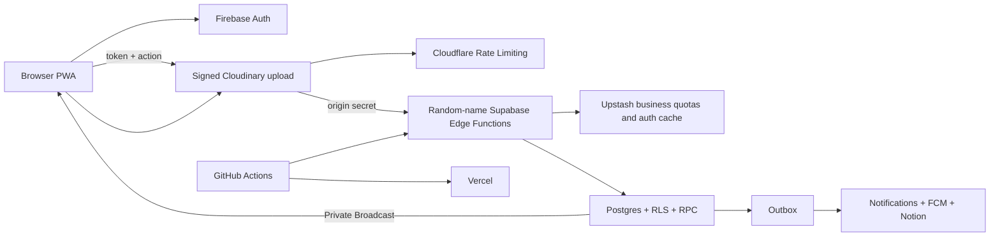

# Architecture

The browser is untrusted. Cloudflare rejects invalid origins, unauthenticated traffic, invalid webhooks, and burst abuse before Supabase. Edge checks precise business quotas through Upstash; RLS, RPC, constraints, and transactions still re-authorize operations and retain authoritative relationships and counters.

## Frontend boundaries

`views/` compose routes, `components/` render application UI, `components/ui/` contains business-free primitives, `composables/` own Vue workflows, `services/` cross API boundaries, `lib/` contains pure helpers, `types/` shares contracts, and `generated/` contains code-generated category policy.

`src/styles/primitives.css` and `components/ui/` define the reusable visual contract, composed in the one-way order `atoms → molecules → organisms`. `AppShell`, `ViewportFrame`, and `RoutePageFrame` own viewport gutters, safe areas, content width, and route-page structure. Shared components compose buttons, cards, lists, dropdowns, dialogs, and controls; elevation is limited to control, card, and floating levels. See the [UI design system](ui-design-system.md) for the full contract and new-page checklist.

For signed-in users, mobile bottom navigation remains visible on both root and child pages. `AppShell` lets each page's scroll viewport extend behind the navigation, while `RoutePageFrame` and `route-scroll-through` place the safe area, floating gap, and navigation height at the end of the content. Content can pass behind the navigation and the final item can still scroll fully into view. Route origin only determines the back destination; navigation chrome remains separate from route content state.

## Localization and error contract

Frontend catalogs live in `src/i18n/messages/<locale>/<domain>.ts`. Each file owns one functional domain, keys use short stable semantic names, and Traditional Chinese and English must expose the same keys. Callers translate by key only; localized source text is never used as a reverse lookup.

`config/api-errors.config.json` is the single source for the public API error contract and generates typed definitions for the frontend, Cloudflare Worker, and Supabase Edge. Failure responses contain only a stable `code` and `requestId`, plus `retryAfterSeconds` for rate limits. Backend-localized sentences and raw provider errors are not exposed; the frontend maps the code to the active locale while technical details remain in logs indexed by request or trace ID.

Outbox, deletion, Push delivery, and maintenance tables store only `error_trace_id uuid`, not repeated error sentences. Dashboard diagnostics likewise expose `failed_task_codes` and `error_trace_id` for frontend presentation.

## Backend Functions

- `n<namespace>-api`: backend action roles, idempotency, validation, and dispatch.
- `n<namespace>-sync`: allowed-domain users and role claims.
- `n<namespace>-media`: signed upload callbacks.
- `n<namespace>-outbox`: notifications, FCM, optional Notion synchronization, and external effects.
- `n<namespace>-delete`: Cloudinary deletion and synchronized state.
- `n<namespace>-maintenance`: retention/maintenance RPCs and worker triggering.

## One runtime category source

Guided setup and category management write through controlled backend actions to Postgres. The frontend reads a runtime catalog, while Edge authorization, workflows, manager assignments, and facility notifications use the same records. Proposal creation snapshots privacy, comments, support, and deadlines onto the proposal. Database triggers permanently lock read access and author visibility after category creation.

## Realtime updates and authentication cache

Content, notifications, and notification state changes use private Supabase Realtime Broadcast topics scoped to the school, administrators, or one user. `realtime.messages` RLS verifies the Firebase identity and role when subscribing; authenticated clients do not directly query the private notification, notification-state, or realtime-event tables. Broadcast only invalidates client state, while Postgres remains the source of truth.

After Edge verifies a Firebase token, it briefly caches the required user record in the Function instance and Upstash Redis. Expiry and entry limits ensure Firebase is queried again when needed while avoiding repeated provider calls without bypassing per-action authorization.

Frontend content reads retain an aggressive per-account cache in memory and IndexedDB to minimize server and provider work. The bounded memory tier is a true LRU whose hit order is refreshed, while the persistent tier keeps its longer lifetime. Each read carries scope and invalidation versions, so a request that finishes after a write, Realtime invalidation, or account switch cannot restore stale content. Persistent cleanup is write-version guarded to avoid deleting newer data.

When a PWA update is available, the waiting Service Worker is asked to take control immediately. After `controllerchange`, navigation reloads through a versioned URL; a watchdog and per-version reload cap stop failed update loops. The handover does not retain a legacy update branch and does not require clearing application data or weakening the content cache.

When retention cleanup removes a proposal or facility that has a mapped Notion page, it queues the Notion deletion marker in the same database transaction. Scheduled retention events skip user notifications but remain on the normal retryable outbox path.

`main` deploys through GitHub `production` to Cloudflare, Supabase, and Vercel. GitHub Actions synchronizes vendor runtime secrets automatically. A `dev`/`development` deployment is optional.
