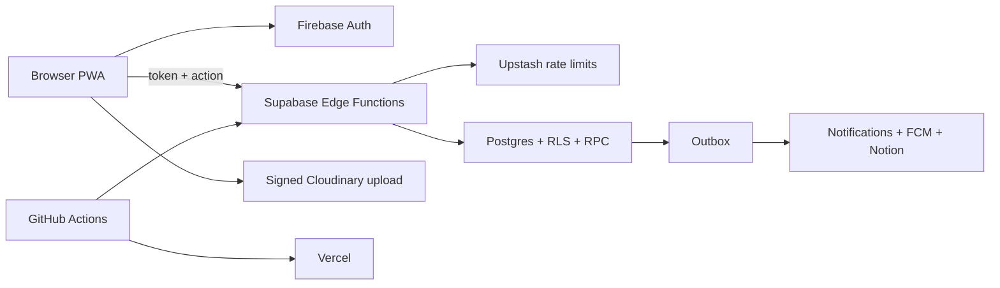

# Architecture

The browser is untrusted. UI conditions improve experience; Edge verification, RLS, RPC, constraints, and transactions enforce policy.

## Frontend boundaries

`views/` compose routes, `components/` render application UI, `components/ui/` contains business-free primitives, `composables/` own Vue workflows, `services/` cross API boundaries, `lib/` contains pure helpers, `types/` shares contracts, and `generated/` contains code-generated category policy.

## Backend Functions

- `backendAction`: CORS, Firebase auth, roles, rate limits, idempotency, validation, and domain dispatch.
- `syncUser`: allowed-domain users and role claims.
- `cloudinaryWebhook`: signed upload callbacks.
- `outboxWorker`: notifications, FCM, optional Notion synchronization, and external effects.
- `processDeletionJobs`: Cloudinary deletion and synchronized state.
- `maintenanceCleanup`: retention/maintenance RPCs and worker triggering.

## One category source

`config/issue-categories.config.json` is validated by `scripts/issue-category-config.mjs`, which generates both `src/generated/issue-categories.ts` and `supabase/functions/_shared/issue-categories.ts`. It derives author storage, upload/comment visibility, comment timing, automatic support expiry, and response-deadline start so frontend and Edge share one policy.

`main` deploys through GitHub `production` to Supabase and Vercel. A `dev`/`development` deployment is optional. The complete file map lives in the main repository's `structure.md`.
