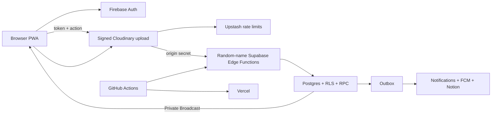

# Architecture

The browser is untrusted. Cloudflare rejects invalid origins, unauthenticated traffic, invalid webhooks, and exhausted limits before Supabase. Edge verification, RLS, RPC, constraints, and transactions still re-authorize every operation.

## Frontend boundaries

`views/` compose routes, `components/` render application UI, `components/ui/` contains business-free primitives, `composables/` own Vue workflows, `services/` cross API boundaries, `lib/` contains pure helpers, `types/` shares contracts, and `generated/` contains code-generated category policy.

## Backend Functions

- `n<namespace>-api`: backend action roles, idempotency, validation, and dispatch.
- `n<namespace>-sync`: allowed-domain users and role claims.
- `n<namespace>-media`: signed upload callbacks.
- `n<namespace>-outbox`: notifications, FCM, optional Notion synchronization, and external effects.
- `n<namespace>-delete`: Cloudinary deletion and synchronized state.
- `n<namespace>-maintenance`: retention/maintenance RPCs and worker triggering.

## One category source

`config/issue-categories.config.json` is validated by `scripts/issue-category-config.mjs`, which generates both `src/generated/issue-categories.ts` and `supabase/functions/_shared/issue-categories.ts`. It derives author storage, upload/comment visibility, comment timing, automatic support expiry, and response-deadline start so frontend and Edge share one policy.

## Realtime updates and authentication cache

Content, notifications, and notification state changes use private Supabase Realtime Broadcast topics scoped to the school, administrators, or one user. `realtime.messages` RLS verifies the Firebase identity and role when subscribing; authenticated clients do not directly query the private notification, notification-state, or realtime-event tables. Broadcast only invalidates client state, while Postgres remains the source of truth.

After Edge verifies a Firebase token, it briefly caches the required user record in the Function instance and Upstash Redis. Expiry and entry limits ensure Firebase is queried again when needed while avoiding repeated provider calls without bypassing per-action authorization.

Frontend content reads are cached per account in memory and IndexedDB. Each read carries scope and invalidation versions, so a request that finishes after a write, Realtime invalidation, or account switch cannot restore stale content. Persistent cleanup is write-version guarded to avoid deleting newer data.

When retention cleanup removes a proposal or facility that has a mapped Notion page, it queues the Notion deletion marker in the same database transaction. Scheduled retention events skip user notifications but remain on the normal retryable outbox path.

`main` deploys through GitHub `production` to Cloudflare, Supabase, and Vercel. GitHub Actions synchronizes vendor runtime secrets automatically. A `dev`/`development` deployment is optional.
