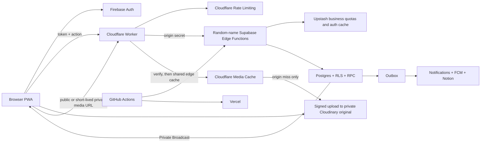

# Architecture

The browser is untrusted. Cloudflare rejects invalid origins, unauthenticated traffic, invalid webhooks, and burst abuse before Supabase. Edge checks precise business quotas through Upstash; RLS, RPC, constraints, and transactions still re-authorize operations and retain authoritative relationships and counters.

## Frontend boundaries

`views/` compose routes, `components/` render application UI, `components/ui/` contains business-free primitives, `composables/` own Vue workflows, `services/` cross API boundaries, `lib/` contains pure helpers, `types/` shares contracts, and `generated/` contains typed outputs for JSON-backed API-error and rate-limit policy. Categories are not generated code.

`src/styles/primitives.css` and `components/ui/` define the reusable visual contract, composed in the one-way order `atoms → molecules → organisms`. `AppShell`, `ViewportFrame`, and `RoutePageFrame` own viewport gutters, safe areas, content width, and route-page structure. Shared components compose buttons, cards, lists, dropdowns, dialogs, and controls; elevation is limited to control, card, and floating levels. Page-level tabs use semantic `AppButton` controls, while exclusive choices and segmented navigation use `SelectionOptionButton` and `PillSegmentedControl`; segmented controls support adaptive content widths or an equal-width layout with every label visible. Session skeletons and live list content stay exclusive, and empty boards use elevation-free `EmptyStatePanel` so unloaded skeleton cards cannot leave residual shadows. See the [UI design system](ui-design-system.md) for the full contract and new-page checklist.

For signed-in users, mobile bottom navigation remains visible on root and ordinary child pages. Proposal, facility-report, and announcement creation routes are focused input pages: they temporarily hide the bottom bar and use the Visual Viewport so the keyboard does not displace the form. `AppShell` lets ordinary page scroll viewports extend behind navigation, while `RoutePageFrame` and `route-scroll-through` place the safe area, floating gap, and navigation height at the end of the content. Content can pass behind the navigation and the final item can still scroll fully into view. Route origin only determines the back destination; navigation chrome remains separate from route content state.

## Localization and error contract

Frontend catalogs live in `src/i18n/messages/<locale>/<domain>.ts`. Each file owns one functional domain, keys use short stable semantic names, and Traditional Chinese and English must expose the same keys. Callers translate by key only; localized source text is never used as a reverse lookup.

`config/api-errors.config.json` is the single source for the public API error contract and generates typed definitions for the frontend, Cloudflare Worker, and Supabase Edge. Failure responses contain only a stable `code` and `requestId`, plus `retryAfterSeconds` for rate limits. Backend-localized sentences and raw provider errors are not exposed; the frontend maps the code to the active locale while technical details remain in logs indexed by request or trace ID.

Outbox, deletion, Push delivery, and maintenance tables store only `error_trace_id uuid`, not repeated error sentences. Dashboard diagnostics likewise expose `failed_task_codes` and `error_trace_id` for frontend presentation.

## Backend Functions

- `n<namespace>-api`: backend action roles, idempotency, validation, and dispatch.
- `n<namespace>-sync`: allowed-domain users and role claims.
- `n<namespace>-media`: signed upload callbacks.
- `n<namespace>-outbox`: notifications, FCM, optional Notion synchronization, and external effects.
- `n<namespace>-delete`: Cloudinary deletion and synchronized state.
- `n<namespace>-maintenance`: retention/maintenance RPCs and worker triggering.

## Cold-start reads and Edge invocations

The public gateway remains the Cloudflare Worker. Each forwarded action still counts as one Supabase Edge Function invocation. Production browser Google sign-in uses the Google Identity Services Token Client, then Firebase `signInWithCredential`; there is no production Firebase redirect recovery path. After sign-in, the client prefers a single `getSessionBootstrap` read for role and permissions, category catalog, content revisions, and notification unread state, and may record the platform visit in the same call. Navigation chrome and leaving the login page wait for that bootstrap so the default proposal category is seeded before the bottom bar or sidebar appears; the sign-in control stays busy until bootstrap settles. Granular actions remain for partial refresh and management writes. The Media Gateway only verifies signed media capabilities, applies fixed variants, and serves edge-cached bytes; Edge still decides whether a user may receive a private URL.

## One runtime category source

Guided setup and System settings share the same category selection and editor structure and write feature switches and categories through controlled backend actions to Postgres; setup explicitly defers manager assignment until those people have registered. Proposal and facility boards both select from the same runtime catalog, and creation plus list queries preserve the category scope; disabled features are hidden from navigation while existing records remain manageable. Categories have no archive state, and the database forces every retained category to remain available. Category deletion permanently removes its records, relations, notifications, and image references in one controlled flow and queues external image deletion. Edge authorization, workflows, manager assignments, and notifications use those records. Feature switches and category drafts are saved together so a partial update cannot leave only one side applied. Proposal creation snapshots privacy, comments, support, and deadlines onto the proposal. Database triggers permanently lock read access and author visibility after category creation.

Platform-administrator identity comes only from `ADMIN_EMAILS`; category assignments are separate scoped data. New proposals and facility reports create personal notifications for explicitly assigned managers rather than an administrator broadcast, so platform administrators are not implicit recipients. Author display for content and comments is loaded by UID so the client does not keep a drifting author copy.

## Unified media delivery

The browser still uploads directly to Cloudinary with a controlled signature, while Cloudinary stores authenticated originals. Every read—content attachments, avatars, and Notion imports—uses the Cloudflare Media Gateway instead of exposing a Cloudinary delivery URL. Edge issues stable public URLs or private URLs valid for about 15 minutes. After validating the signature, the Worker checks its shared edge cache and contacts Cloudinary only on a miss. Image strips load one fixed 320×240 thumbnail; document images and the lightbox load the full image. Private responses are not retained in the browser, but authorized users can share the Worker-side cached bytes.

## Realtime updates and authentication cache

Content, notifications, and notification state changes use private Supabase Realtime Broadcast topics scoped to the school, administrators, or one user. `realtime.messages` RLS verifies the Firebase identity and role when subscribing; authenticated clients do not directly query the private notification, notification-state, or realtime-event tables. Broadcast only invalidates client state, while Postgres remains the source of truth.

After Edge verifies a Firebase token, it briefly caches the required user record in the Function instance and Upstash Redis. Expiry and entry limits ensure Firebase is queried again when needed while avoiding repeated provider calls without bypassing per-action authorization.

Frontend content reads retain an aggressive per-account cache in memory and IndexedDB to minimize server and provider work. The bounded memory tier is a true LRU whose hit order is refreshed, while the persistent tier keeps its longer lifetime. Each read carries scope and invalidation versions, so a request that finishes after a write, Realtime invalidation, or account switch cannot restore stale content. Persistent cleanup is write-version guarded to avoid deleting newer data. Proposal cards prefetch only the intended record on pointer or focus intent and coalesce that request with the detail route. On click, a one-use list summary renders a stable detail skeleton immediately instead of blocking the entire page on the first detail read.

When a PWA update is available, the waiting Service Worker is asked to take control immediately. After `controllerchange`, navigation reloads through a versioned URL; a watchdog and per-version reload cap stop failed update loops. The handover does not retain a legacy update branch and does not require clearing application data or weakening the content cache.

When retention cleanup removes a proposal or facility that has a mapped Notion page, it queues the Notion deletion marker in the same database transaction. Scheduled retention events skip user notifications but remain on the normal retryable outbox path.

`main` deploys through GitHub `production` to Cloudflare, Supabase, and Vercel. GitHub Actions synchronizes vendor runtime secrets automatically. A `dev`/`development` deployment is optional.
