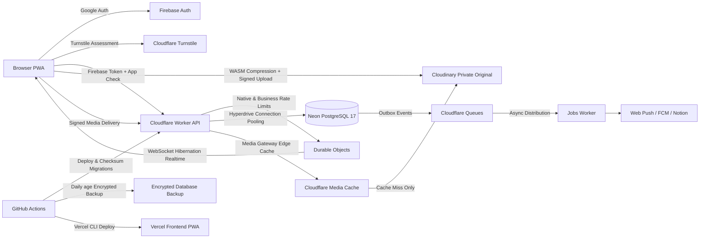

# Architecture

This document describes Novae's system architecture, technical boundaries, request lifecycles, and security controls.

## System Request Flow

```mermaid
flowchart LR
  U[Browser PWA] -->|Google Auth| F[Firebase Auth]
  U -->|Turnstile Assessment| T[Cloudflare Turnstile]
  U -->|Firebase Token + App Check| CFW[Cloudflare Worker API]
  CFW -->|Native & Business Rate Limits| DO[Durable Objects]
  CFW -->|Hyperdrive Connection Pooling| P[(Neon PostgreSQL 17)]
  DO -->|WebSocket Hibernation Realtime| U
  U -->|WASM Compression + Signed Upload| CLD[Cloudinary Private Original]
  U -->|Signed Media Delivery| CFW
  CFW -->|Media Gateway Edge Cache| MC[Cloudflare Media Cache]
  MC -->|Cache Miss Only| CLD
  P -->|Outbox Events| Q[Cloudflare Queues]
  Q -->|Async Distribution| W[Jobs Worker]
  W --> N[Web Push / FCM / Notion]
  G[GitHub Actions] -->|Deploy & Checksum Migrations| CFW
  G -->|Daily age Encrypted Backup| BK[Encrypted Database Backup]
  G -->|Vercel CLI Deploy| V[Vercel Frontend PWA]
```

Core Principle: **The browser environment is untrusted**. Cloudflare Worker serves as the single public API gateway, validating CORS origins, Firebase Auth JWTs, App Check, and Turnstile tokens before routing queries to Neon PostgreSQL via Cloudflare Hyperdrive. All database transactions execute under a least-privilege `novae_runtime` role.

## Frontend Architecture (Next.js 16 App Router)

| Directory | Responsibilities & Boundaries |
| --- | --- |
| `src/app/` | Next.js App Router route and layout composition, viewport handling, and global providers; never imports backend services directly |
| `src/components/ui/` | Business-free UI primitives based on Radix UI and Tailwind CSS 4 |
| `src/components/motion/` | transitions.dev motion recipes (`LiquidTabs`, `ResizableCard`, calm skeleton shimmer, animated counters, reaction feedback) |
| `src/components/admin/` | Admin Console (overview metrics, user search, member restrictions, audit logging, scoped managers, and platform settings) |
| `src/hooks/` | React workflows, state management, cache lifecycle, and domain interactions |
| `src/services/` | Cloudflare Worker API client, WebSocket realtime hub, Cloudinary upload, and Firebase authentication boundaries |
| `src/lib/` | React-free utilities (`navigation-memory`, request abort/timeout handling, WASM image compression, Markdown sanitization) |
| `src/i18n/` | Traditional Chinese (`zh-TW`) and English (`en`) domain message catalogs with reactive locale switching |

### UI and Motion System
- **Styling**: `src/app/globals.css` and `src/styles/motion.css` define global tokens, typography, radii, 3-tier elevation, and motion curves.
- **Accent Themes**: Supports customizable accent palettes (Slate, Indigo, Emerald, Rose, etc.) with seamless light/dark mode transitions.
- **Navigation Memory (`navigation-memory`)**: Stamps monotonic history indices on in-app route transitions to guarantee deterministic depth-aware left/right slide animations.
- **Docked Comment Composer**: CommentComposer adheres to safe areas and visual viewport keyboard adjustments.

## Backend and Database Topology

| Component | Role and Security Controls |
| --- | --- |
| **Cloudflare Worker API** | Sole public API gateway handling action dispatch, JWT verification, App Check, Turnstile Siteverify, and media delivery |
| **Cloudflare Hyperdrive** | Connection pooling and query caching between Workers and Neon PostgreSQL |
| **Cloudflare Durable Objects** | SQLite-backed per-UID rate limiters and WebSocket Hibernation realtime broadcast hub |
| **Cloudflare Queues (`novae-jobs`)** | Asynchronous outbox worker managing Web Push (FCM), Notion synchronization, media pruning, and retention purges |
| **Neon PostgreSQL 17** | Authoritative database source of truth accessed exclusively via the least-privilege `novae_runtime` role (DML, sequences, and functions only; no DDL permissions) |

## Data Versioning and Realtime Hub

- Proposals, facilities, and announcements maintain monotonic PostgreSQL version timestamps.
- Mutations increment version stamps and broadcast updates through Durable Objects WebSocket Hibernation.
- Frontend clients apply local patches optimistically; reconnects or version sequence gaps trigger a silent `getContentVersions` reconcile.

## Data Retention Lifecycle and Backups

- **Closed Case Purging**: Proposals and facility reports closed for longer than the retention window (default 180 days) are permanently pruned along with comments, votes, and Cloudinary media assets.
- **Audit Log Rotation**: Administrative audit records are purged after 365 days.
- **Automated Daily Backups**: Managed by GitHub Actions (`backup-database.yml`), creating logical `pg_dump` exports encrypted with `age` and uploaded as GitHub Artifacts.
