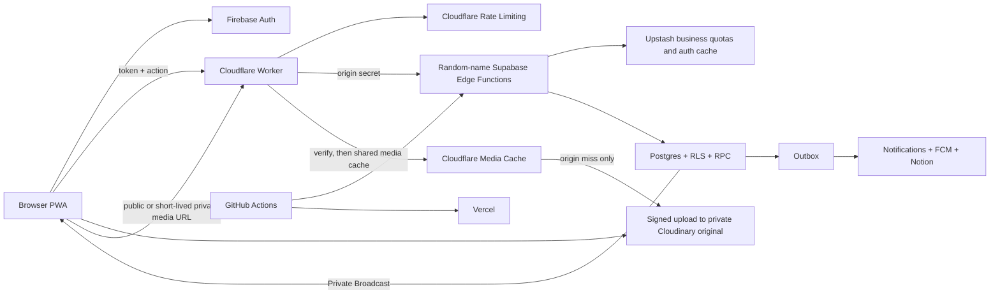

# Architecture

```mermaid
flowchart LR
  U[Browser PWA] --> F[Firebase Auth]
  U -->|token + action| C[Cloudflare Worker]
  C --> RL[Cloudflare Rate Limiting]
  C -->|origin secret| E[Random-name Supabase Edge Functions]
  E --> R[Upstash business quotas and auth cache]
  E --> P[Postgres + RLS + RPC]
  P -->|Private Broadcast| U
  U --> CLD[Signed upload to private Cloudinary original]
  U -->|public or short-lived private media URL| C
  C -->|verify, then shared media cache| MC[Cloudflare Media Cache]
  MC -->|origin miss only| CLD
  P --> O[Outbox]
  O --> W[Notifications + FCM + Notion]
  G[GitHub Actions] --> E
  G --> V[Vercel]
```

The browser is untrusted. Cloudflare rejects invalid origins, unauthenticated traffic, invalid webhooks, and burst abuse before Supabase. Edge checks precise business quotas through Upstash; RLS, RPC, constraints, and transactions still re-authorize operations and retain authoritative relationships and counters.

## Frontend boundaries

`app/` contains Next App Router route and layout composition, `components/` renders application UI, `components/ui/` contains business-free shadcn/Radix primitives, `components/motion/` owns reusable state-change motion, `hooks/` owns React workflows, `services/` crosses API boundaries, `lib/` contains React-free helpers, `types/` shares contracts, and `generated/` contains typed outputs for JSON-backed API-error and rate-limit policy. Categories are not generated code.

`src/app/globals.css`, `src/styles/motion.css`, `components/ui/`, and `components/motion/` define the reusable visual contract. `AppShell` owns viewport gutters, safe areas, content width, and desktop/mobile navigation. Buttons, cards, lists, dropdowns, dialogs, and controls compose shadcn/Radix primitives; elevation remains limited to control, card, and floating levels. Segmented controls and navigation share one liquid selection contract. Non-interactive surfaces remain still, while hover is enabled only for `hover: hover` and `pointer: fine`; primary mobile controls remain at least 44px. See the [UI design system](ui-design-system.md) for the full contract and new-page checklist.

For signed-in users, mobile bottom navigation remains visible while the current page title provides the header context; the app does not stack a duplicate title row. `AppShell` owns safe-area padding, bottom-navigation clearance, and trailing content space so the last item remains reachable. Route origin determines only the back destination, while navigation chrome remains separate from route content state.

All `localStorage` and `sessionStorage` access goes through safe helpers. Storage blocking, private browsing, quota failures, and SSR may degrade caching but cannot block sign-in, application updates, or Push-device workflows. Production HTML generates an exact CSP from the active API and Supabase origins; it intersects with the Vercel header to constrain script, frame, connect, image, and worker sources. HarmonyOS Sans TC ships only the used 400/500/600/700 weights without changing the family or rendered weight mapping.

All three detail surfaces share a compact toolbar, body, and sidebar composition without a separate title-background card. Proposal and facility sidebars present progress, hand reactions, and a responsive timeline; announcements retain the heart reaction. Counts update with fixed-width number transitions. Discussion is one continuous surface rather than one card per comment, and the composer appears at the actual reply location with reply context. Mobile renders body, actions, and discussion in sequence without a second header or duplicate bottom entry. Dialogs center on desktop and may become bottom sheets on narrow screens while preserving shared Radix focus, dismissal, and ARIA behavior.

Domain hooks share the existing service boundary for list reads, search, sorting, and pagination. Successful mutations patch React state in place instead of refreshing the whole document. Route changes remount only route content while the persistent app shell remains stable; failures retain retry paths, and empty/loading states use shared page-state and skeleton primitives.

## Localization and error contract

Frontend catalogs live in `src/i18n/messages/<locale>/<domain>.ts`. Each file owns one functional domain, keys use short stable semantic names, and Traditional Chinese and English must expose the same keys. Callers translate by key only; localized source text is never used as a reverse lookup.

`config/api-errors.config.json` is the single source for the public API error contract and generates typed definitions for the frontend, Cloudflare Worker, and Supabase Edge. Failure responses contain only a stable `code` and `requestId`, plus `retryAfterSeconds` for rate limits. Backend-localized sentences and raw provider errors are not exposed; the frontend maps the code to the active locale while technical details remain in logs indexed by request or trace ID.

Outbox, deletion, Push delivery, and maintenance tables store only `error_trace_id uuid`, not repeated error sentences. Dashboard diagnostics likewise expose `failed_task_codes` and `error_trace_id` for frontend presentation.

## Backend Functions

- `n<namespace>-api`: backend action roles, idempotency, validation, and dispatch.
- `n<namespace>-sync`: allowed-domain users and role claims.
- `n<namespace>-media`: signed upload callbacks.
- `n<namespace>-outbox`: notifications, FCM, optional Notion synchronization, and external effects.
- `n<namespace>-delete`: Cloudinary deletion and synchronized state.
- `n<namespace>-maintenance`: retention/maintenance RPCs and worker triggering.

## Cold-start reads and Edge invocations

The public gateway remains the Cloudflare Worker. Each forwarded action still counts as one Supabase Edge Function invocation. Production browser Google sign-in uses the Google Identity Services Token Client, then Firebase `signInWithCredential`; there is no production Firebase redirect recovery path. After sign-in, the client prefers a single `getSessionBootstrap` read for role and permissions, category catalog, content versions, and notification unread state, and may record the platform visit in the same call. Inside Edge, bootstrap now uses only the access-context lookup plus one Postgres snapshot request. Proposal, personal-proposal, facility, and announcement lists likewise use one snapshot RPC each for policy, page data, and the content version instead of separate category, policy-array, or version requests. Navigation chrome and leaving the login page wait for bootstrap so the default proposal category is seeded before the bottom bar or sidebar appears; the sign-in control stays busy until bootstrap settles. Granular actions remain for partial refresh and management writes. The Media Gateway only verifies signed media capabilities, applies fixed variants, and serves edge-cached image bytes; mutable content lists use `no-store` so status and comment settings are not held at POPs. Edge still decides whether a user may receive a private URL. Removing list POP caching adds some forwarded requests and Edge invocations in exchange for current state.

Content creation, workflow transitions, and external effects retain replayable database-backed idempotency. Announcement likes and support removal set an explicit final state, so they remain request-ID-protected and business-rate-limited naturally idempotent operations without an additional claim/complete ledger write on every success.

## One runtime category source

Guided setup and System settings share the same category selection and editor structure; setup explicitly defers manager assignment until those people have registered. System settings stage feature switches plus proposal/facility category creations, edits, and deletions locally, then submit one controlled backend action and one Postgres transaction. Validation or any failed step rolls the entire draft back. Proposal and facility boards both select from the same runtime catalog, and creation plus list queries preserve the category scope; disabled features are hidden from navigation while existing records remain manageable. Categories have no archive state, and the database forces every retained category to remain available. Category deletion permanently removes its records, relations, notifications, and image references and queues external image deletion. Proposal creation snapshots privacy, support, and deadlines onto the proposal; comment availability is determined by the runtime category constraint and terminal status. Disabling a category immediately blocks comments for all its proposals, while re-enabling restores non-completed proposals. Database triggers permanently lock read access and author visibility after category creation.

System settings commit proposal/facility feature switches, the global announcement comment switch, and both category drafts through one controlled backend action and Postgres transaction. Announcements have no category: their global comment switch is a live constraint for every announcement and has no per-record override. Platform-administrator identity comes only from `ADMIN_EMAILS`; category assignments are separate scoped data. New proposals and facility reports create personal notifications for explicitly assigned managers rather than an administrator broadcast, so platform administrators are not implicit recipients. Author display for content and comments is loaded by UID so the client does not keep a drifting author copy.

## Unified media delivery

The browser still uploads directly to Cloudinary with a controlled signature, while Cloudinary stores authenticated originals. Every read—content attachments, avatars, and Notion imports—uses the Cloudflare Media Gateway instead of exposing a Cloudinary delivery URL. Edge issues stable public URLs or private URLs valid for about 15 minutes. After validating the signature, the Worker checks its shared edge cache and contacts Cloudinary only on a miss. Image strips load one fixed 320×240 thumbnail; document images and the lightbox load the full image. Private responses are not retained in the browser, but authorized users can share the Worker-side cached bytes.

## Realtime updates and authentication cache

Content, notification, comment-setting, and notification-state changes use private Supabase Realtime Broadcast topics scoped to the school, administrators, or one user. `realtime.messages` RLS verifies the Firebase identity and role when subscribing; authenticated clients do not directly query private realtime tables. Proposals, announcements, and facilities each use a monotonic Postgres version stamp, and content events carry the version from the same transaction. Contiguous events patch local state; a version gap triggers a silent refresh. App resume, browser-online recovery, and Realtime reconnect share one batched `getContentVersions` validation, while the Cloudflare Worker remains a stateless gateway. Postgres remains the source of truth.

After Edge verifies a Firebase token, it briefly caches the required user record in the Function instance and Upstash Redis. Expiry and entry limits ensure Firebase is queried again when needed while avoiding repeated provider calls without bypassing per-action authorization.

Frontend content reads retain an aggressive per-account cache in memory and IndexedDB to minimize server and provider work. The bounded memory tier is a true LRU whose hit order is refreshed, while the persistent tier keeps its longer lifetime. List responses include the domain version captured before the data query, so normal list reads require no separate version action and cannot certify stale data as current. Requests that finish after invalidation cannot restore stale content. Silent first-page refreshes keep the current UI and restore the visible item’s relative scroll position by content id. Proposal cards prefetch only the intended record on pointer or focus intent and coalesce that request with the detail route. On click, a one-use list summary renders a stable detail skeleton immediately instead of blocking the entire page on the first detail read.

When a PWA update is available, the waiting Service Worker is asked to take control immediately. After `controllerchange`, navigation reloads through a versioned URL; a watchdog and per-version reload cap stop failed update loops. The handover does not retain a legacy update branch and does not require clearing application data or weakening the content cache.

Postgres remains the source of truth for external effects. Pushes receive a durable delivery key and are claimed through a short lease. Transient FCM failures record attempts and exponential backoff while the owning outbox event remains failed so the existing schedule wakes the worker again. Success clears the stored payload; permanently invalid tokens are removed.

Before creating a Notion page, the worker reserves a `pending:<uuid>` mapping in Postgres and writes a stable `Novae ID` to the page. If the remote create succeeds but the local mapping write is interrupted, the retry finds that page by ID and finishes the mapping instead of creating a duplicate. A stale reservation can be safely reclaimed.

When retention cleanup removes a proposal or facility that has a mapped Notion page, it queues the Notion deletion marker in the same database transaction. Scheduled retention events skip user notifications but remain on the normal retryable outbox path. The maintenance snapshot reports which outbox or deletion workers actually have due work in the same database request; after commit, Edge invokes only those workers. Event triggers remain the immediate path, while the cron safety net runs every five minutes rather than polling every minute.

`main` deploys through GitHub `production` to Cloudflare, Supabase, and Vercel. GitHub Actions synchronizes vendor runtime secrets automatically. A `dev`/`development` deployment is optional.
