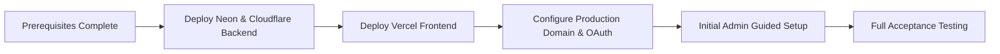

# Final release and acceptance

Use this page after all service setups and production secrets are configured. The initial administrator completes guided category setup in the app after deployment.

## Prerequisites

- [ ] GitHub, Firebase, Neon, Cloudinary, Cloudflare, and Vercel are ready; optional Notion is ready when needed.
- [ ] Every required value from the [credential worksheet](environment-configuration.md) is in GitHub `production` Environment secrets.
- [ ] The campus domain and initial administrator in `ADMIN_EMAILS` are final.
- [ ] Proposal and facility-report rules are prepared for initial setup.

## Deployment Flow

## 1. Verify Production Secrets

Open `Settings → Environments → production` in your GitHub fork and compare every entry with the [credential worksheet](environment-configuration.md).

Important matching pairs:
- `NEXT_PUBLIC_ALLOWED_DOMAIN` = `ALLOWED_DOMAIN`
- `NEXT_PUBLIC_FIREBASE_PROJECT_ID` = `FIREBASE_PROJECT_ID`
- `NEXT_PUBLIC_FIREBASE_API_KEY` = `FIREBASE_WEB_API_KEY`
- `NEXT_PUBLIC_GOOGLE_CLIENT_ID` is the same GCP project's Web OAuth Client ID, with Authorized JavaScript origins covering production and local development.
- `CLOUDFLARE_WORKER_URL` and `ALLOWED_ORIGINS` include `https://` and have **no trailing slashes**.
- `ALLOWED_ORIGINS` is the Vercel frontend origin, not the Worker URL.
- `NEON_DATABASE_URL` and `NEON_RUNTIME_PASSWORD` are valid.

## 2. Deploy Backend (Deploy Neon and Cloudflare Backend)

In GitHub `Actions`, select `Deploy Neon and Cloudflare Backend` and trigger `Run workflow` on `main`.

The workflow executes:
1. **Verifies Contracts and Types**: Runs `npm run generate:all`, checks Worker types, and verifies architecture boundaries.
2. **Applies Neon Migrations**: Runs `npm run db:migrate` with canonical checksum validation.
3. **Configures Runtime Role**: Configures least-privilege `novae_runtime` database role via `configure-database-runtime.mjs`.
4. **Provisions Cloudinary Preset**: Auto-provisions the `srp-secure-images` preset.
5. **Synchronizes Hyperdrive**: Binds verified runtime database credentials to Cloudflare Hyperdrive.
6. **Creates Cloudflare Queue**: Ensures `novae-jobs` queue exists.
7. **Deploys Cloudflare Worker**: Deploys Worker API and Durable Objects.
8. **Runs Healthcheck Smoke Test**: Verifies unauthorized requests return `401` and authenticated healthcheck returns `200` with active database connection.

## 3. Deploy Frontend (Deploy Frontend to Vercel)

After backend success, run `Deploy Frontend to Vercel`. It uses `CLOUDFLARE_WORKER_URL` as the frontend API endpoint, builds the Next.js 16 PWA bundle, and deploys prebuilt artifacts to Vercel production.

## 4. Add Production Domain & OAuth

1. Connect the custom domain in Vercel.
2. Add the domain to Firebase Authentication **Authorized domains**.
3. Add the origin to Google Cloud Console **Authorized JavaScript origins** for `NEXT_PUBLIC_GOOGLE_CLIENT_ID`.
4. If using Cloudflare Turnstile, add the domain to the Turnstile Widget configuration.

## 5. Production Acceptance Checklist

- [ ] Allowed-domain Google sign-in works; other domains are rejected.
- [ ] First-time profile creation completes single-use Cloudflare Turnstile verification.
- [ ] Initial platform administrator completes language confirmation and dynamic category setup.
- [ ] Proposal support, facility "I also encountered this", and announcement like reactions update optimistically.
- [ ] Images upload with client-side WebAssembly WebP compression and render through the Worker Media Gateway.
- [ ] Realtime discussion updates and notifications function smoothly.
- [ ] Admin Console provides metrics, user search, member restrictions (mute/ban), and audit logging.
- [ ] In-app notifications and Web Push notifications arrive reliably.
- [ ] If Notion is enabled, operations pages are synchronized as expected.

Next: Follow [post-launch operations](operations.md).
