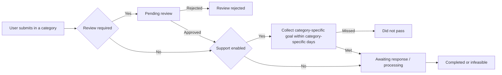

# Product and workflows

Novae is a campus PWA for proposals, support, review, responses, announcements, and notifications. It replaces disconnected forms and posts with a permission-aware, stateful, time-bound workflow.

## The proposal lifecycle

The real statuses are pending review, awaiting response, review rejected, processing, did not pass, infeasible, and completed.

## What each category controls

Each category independently sets who may read, whether the author is shown, whether support is enabled, the support goal, the support window in days, and the response deadline. The repository's 50 supporters in 14 days is an example configuration, not a hard-coded product rule.

Use the [category builder](../../category-builder.html) to create rules for your institution.

## Real product capabilities

- Google sign-in restricted to an allowed school domain.
- Public-after-review and owner/admin-only privacy models.
- Proposal search, comments, sharing, support, review, status, and deadlines.
- Separate announcement, notification, settings, and admin Dashboard pages.
- Signed Cloudinary image upload and expiring signed delivery.
- Supabase Postgres, RLS, RPC, Realtime, Edge Functions, and outbox processing.
- In-app notifications, Firebase Cloud Messaging Web Push, and a Notion operations copy.

Next: begin [preparation and service setup](quick-start.md).
