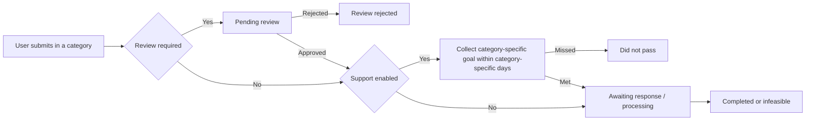

# Product and workflows

Novae is an open-source campus Progressive Web App (PWA) for proposals, facility reports, support, review, official responses, announcements, in-app notifications, and Web Push. It organizes campus feedback into transparent, category-scoped, time-bound, and verifiable workflows.

## User Roles

| Role | Capabilities |
| --- | --- |
| Campus User | Signs in with allowed school Google domain; browses, searches, submits proposals, supports, comments, reads announcements, manages push notifications, and customizes accent themes |
| Proposal Author | Tracks public, pending, or private proposal progress from "My Proposals" with real-time review and status updates |
| Category Manager | Reviews, replies to, updates statuses, and resolves proposals or facilities within assigned categories; multiple managers per category supported |
| Platform Administrator | Defined via `ADMIN_EMAILS`; accesses the Admin Console to view activity metrics, search users, enforce interaction restrictions (mute/ban), inspect audit logs, and configure media limits and data retention |

## The Proposal Lifecycle

```mermaid
flowchart LR
  A[User submits in a category] --> B{Review required}
  B -->|Yes| C[Pending review]
  C -->|Rejected| D[Review rejected]
  C -->|Approved| E{Support enabled}
  B -->|No| E
  E -->|Yes| F[Collect category-specific goal within category-specific days]
  F -->|Missed| G[Did not pass]
  F -->|Met| H[Awaiting response / processing]
  E -->|No| H
  H --> I[Completed or infeasible]
```

The real statuses are pending review, awaiting response, review rejected, processing, did not pass, infeasible, and completed.

## What Each Category Controls

Each proposal category independently configures:
- **Visibility**: School-wide, school-wide after review, or author-and-admin-only (private rights cases).
- **Author Display**: Publicly visible or anonymous in the feed.
- **Support Mechanism**: Enable/disable support, required supporter count (positive integer), and support window in days.
- **Response Deadline**: Expected response time in days once processing begins, or no deadline.

The default 50 supporters in 14 days is an example configuration. Administrators customize all rules during initial setup and manage them in System Settings.

## Real Product Capabilities

- **Modern Frontend & Silky Motion**: Built on Next.js 16 App Router and React 19, featuring transitions.dev motion recipes (`LiquidTabs`, `ResizableCard`, calm skeleton shimmer, depth-aware directional transitions) and customizable accent themes.
- **Announcements & Discussions**: Standalone announcement feeds with likes and discussion threads; comment composer with mobile safe-area docking and reply threading.
- **Facilities Board**: Multi-category facility reporting with location tags, photos, "I also encountered this" counter, and category-scoped workflows.
- **Realtime & Web Push**: Private in-app realtime updates via Cloudflare Durable Objects WebSocket Hibernation and Web Push via Firebase Cloud Messaging with 7-day heartbeat throttling.
- **WebAssembly Media Pipeline**: Client-side WebAssembly WebP encoding (`@jsquash/webp`) under strict CSP, signed Cloudinary uploads, and cached Worker Media Gateway delivery.
- **Robust Backend & Database**: Neon Serverless PostgreSQL 17 source of truth, Cloudflare Workers API backend, Cloudflare Hyperdrive connection pooling, and least-privilege `novae_runtime` database role.
- **Asynchronous Queues & Data Lifecycle**: Cloudflare Queues (`novae-jobs`) for outbox dispatch, Notion operational copy sync, and automated retention cleanup (expiring closed records, audit logs, inactive PII, and dead push tokens).
- **Integrated Admin Console**: System overview metrics, user search, member interaction restrictions (mute, comment limits, full suspension), audit logging, and platform media/retention configuration.

Next: begin [preparation and service setup](quick-start.md).
