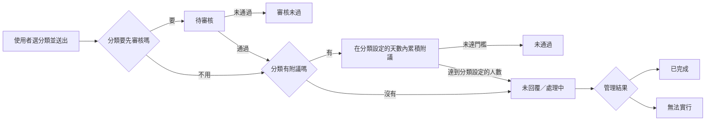

# 產品與流程

Novae 是校內提案、設備回報、附議、審核、回覆、公告與通知的 PWA。它把分散在表單、貼文與私訊裡的校園議題，整理成有分類權限、有狀態、有期限、可追蹤的流程。

## 誰會使用

| 角色 | 實際能做的事 |
| --- | --- |
| 校內使用者 | 使用允許網域的 Google 帳號登入；瀏覽、搜尋、提案、附議、留言、看公告與通知 |
| 提案作者 | 從「我的提案」追蹤公開、待審核或私密案件 |
| 分類負責人 | 依指派的提案或設備分類審核、回覆、更新狀態與處理案件；同分類可多人負責 |
| 平台總管理員 | 由 `ADMIN_EMAILS` 決定；跨分類維運、發布公告並查看 Dashboard，但不自動接收所有新案件通知 |

## 一件提案如何前進

實際狀態包含：待審核、未回覆、審核未過、處理中、未通過、無法實行、已完成。狀態由文字與一致的低飽和色呈現，不只依靠顏色。

## 分類決定哪些行為

每個分類都可以分開設定：

- 誰能閱讀：校內、審核後校內、或只有作者與管理員。
- 作者是否顯示。
- 是否開放附議。
- 開放附議時，需要多少人，以及開放幾天。
- 進入回應階段後，管理單位應在幾天內回覆；也可以不設期限。

因此「公共議題 50 人／14 天」只是範例，不是系統寫死的規則。首位管理員可在首次登入引導建立符合學校制度的設定，日後再由分類管理頁維護。

## 其他真實功能

- 公告有獨立列表與詳情頁，支援按讚與留言。
- 設備回報具有動態多分類看板、分類式新增、圖片、留言、「我也遇到」、狀態與分類範圍管理。
- 通知有獨立頁面，並可搭配 Firebase Cloud Messaging 發送 Web Push。
- 圖片會在瀏覽器壓成 WebP，再經簽名流程存入 Cloudinary；讀取使用短效簽名網址。
- Supabase Postgres 是主要資料來源；RLS、RPC 與 Edge Functions 負責授權與交易。
- outbox worker 處理通知、FCM、Notion 營運副本等外部副作用。
- 管理 Dashboard 顯示平台、提案、公告、通知與背景工作的狀態。

## 適合與不適合

適合有校內 Google 網域、願意指定管理員並建立公開處理規則的學校。若沒有可驗證的校內帳號網域、沒有任何人負責審核與回覆，或需要讓匿名訪客公開投稿，現有產品流程就不適合直接使用。

下一步：從[部署準備與服務設定](quick-start.md)開始建立所需服務。
