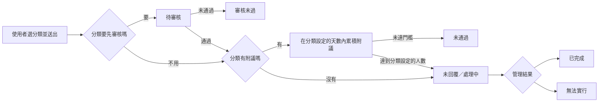

# 產品與流程

Novae 是一套專為校內社群設計的 Progressive Web App (PWA)，支援提案、設備回報、附議、審核、回覆、公告、站內即時通知與 Web Push。它把分散在表單、貼文與私訊裡的校園議題，整理成有分類權限、有狀態、有期限且透明可追蹤的完整流程。

## 誰會使用

| 角色 | 實際能做的事 |
| --- | --- |
| 校內使用者 | 使用允許網域的 Google 帳號登入；瀏覽、搜尋、提案、附議、留言、查看公告與即時通知、自訂外觀強調色 |
| 提案作者 | 從「我的提案」追蹤公開、待審核或私密案件進度，接收即時審核與狀態回覆通知 |
| 分類負責人 | 依指派的提案或設備分類進行審核、回覆、更新狀態與處理案件；同分類支援多人共同負責 |
| 平台總管理員 | 由 `ADMIN_EMAILS` 決定；於管理主控台查看全站活動指標、執行使用者搜尋與互動限制（禁言／限制提案／凍結）、查閱審計日誌、設定平台媒體限制與保留期，但不自動接收所有新案件通知 |

## 一件提案如何前進

```mermaid
flowchart LR
  A[使用者選分類並送出] --> B{分類要先審核嗎}
  B -->|要| C[待審核]
  C -->|未通過| D[審核未過]
  C -->|通過| E{分類有附議嗎}
  B -->|不用| E
  E -->|有| F[在分類設定的天數內累積附議]
  F -->|未達門檻| G[未通過]
  F -->|達到分類設定的人數| H[未回覆／處理中]
  E -->|沒有| H
  H --> I{管理結果}
  I --> J[已完成]
  I --> K[無法實行]
```

實際狀態包含：待審核、未回覆、審核未過、處理中、未通過、無法實行、已完成。狀態由語意文字與符合無障礙規範的一致色標呈現，不單純依靠顏色區分。

## 分類決定哪些行為

每個提案分類都可以分開設定：

- **閱讀範圍**：全校可讀、審核後全校可讀、或僅作者與管理員可見（私密權益案件）。
- **作者顯示**：公開顯示作者或具名隱藏。
- **附議機制**：是否開放附議；開放時可自訂門檻人數（正整數）與附議有效天數。
- **回應期限**：進入處理階段後管理單位應在幾天內回覆；亦可設定為不設期限。

因此「公共議題 50 人／14 天」只是預設範例，首位管理員可在首次登入引導中選擇啟用功能並建立符合學校制度的分類，後續可在「系統設定」隨時調整與指派負責人。

## 完整核心能力

- **現代化前端與動效體驗**：基於 Next.js 16 App Router 與 React 19，採用 transitions.dev 動態配方（`LiquidTabs` 滑動標籤、`ResizableCard` 高度自適應、微光骨架屏、深度導覽記憶轉場）及可自訂強調色彩主題。
- **公告與討論**：公告具備獨立列表與詳情，支援按讚與討論；討論區組件具備桌面與手機安全底欄避讓與回覆軌道折疊。
- **設備回報**：提供多分類報修看板、地點標記、圖片上傳、「我也遇到」手勢反饋與分類負責人獨立流程。
- **即時通知與 Web Push**：支援站內私有即時推送（Cloudflare Durable Objects WebSocket Hibernation）與 Firebase Cloud Messaging Web Push，具備 7 天心跳節流與精準權限分流。
- **圖片與 WebAssembly 編碼**：客戶端在嚴格 CSP 下以 WebAssembly（`@jsquash/webp`）高效率壓成 WebP，經後端簽章上傳 Cloudinary，並由 Cloudflare Worker Media Gateway 進行快取與權限驗證傳送。
- **堅固後端架構**：以 Neon Serverless PostgreSQL 17 為單一真實來源，Cloudflare Workers API 作為後端核心，透過 Cloudflare Hyperdrive 連線加速並以最低權限 `novae_runtime` 角色隔離。
- **非同步佇列與生命週期維護**：Cloudflare Queues (`novae-jobs`) 處理通知分發、Notion 營運副本同步，並定期執行資料保留排程（清理過期結案、審計日誌、未活躍個資與無效推播 Token）。
- **整合式管理主控台 (Admin Console)**：包含全站活動與提案趨勢指標、使用者全文檢索、多層次互動限制（禁言、限制提案、凍結帳號）、審計日誌與平台媒體/保留期設定。

## 適合與不適合

適合擁有校內 Google 網域、願意指定管理員並建立透明處理規則的學校或組織。若沒有可驗證的校內帳號網域、沒有專責人員負責審核與回覆，或需要讓匿名訪客公開投稿，現有產品流程就不適合直接使用。

下一步：從[部署準備與服務設定](quick-start.md)開始建立所需服務。
